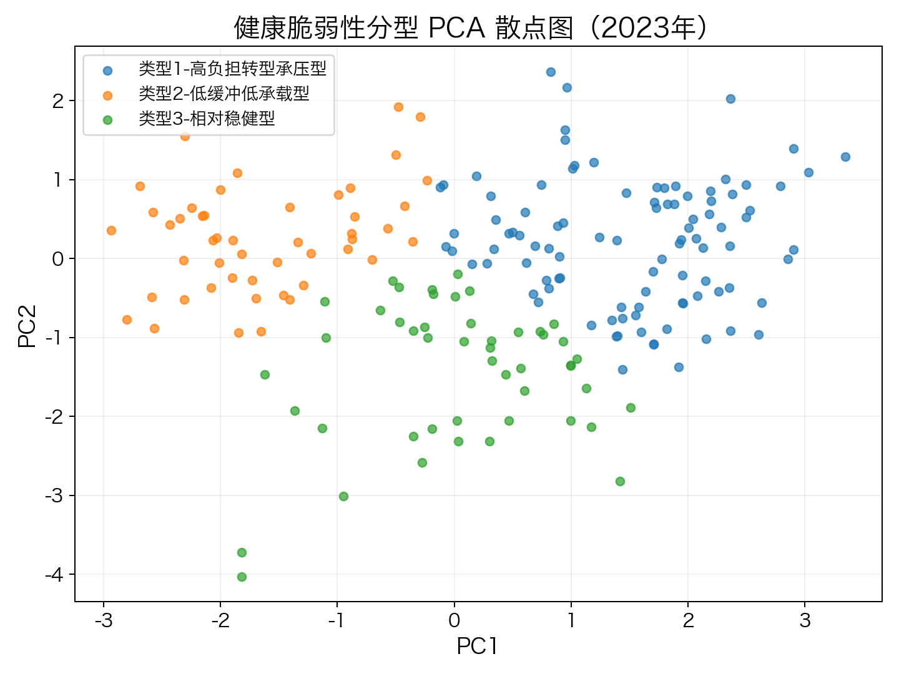
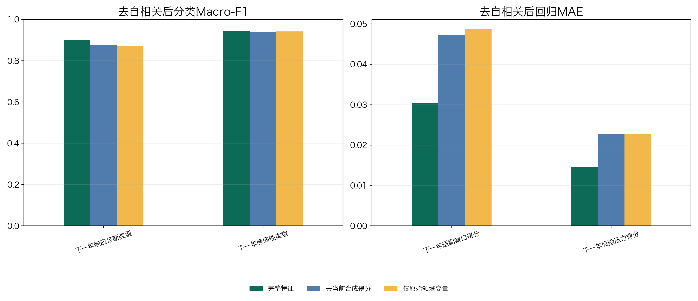
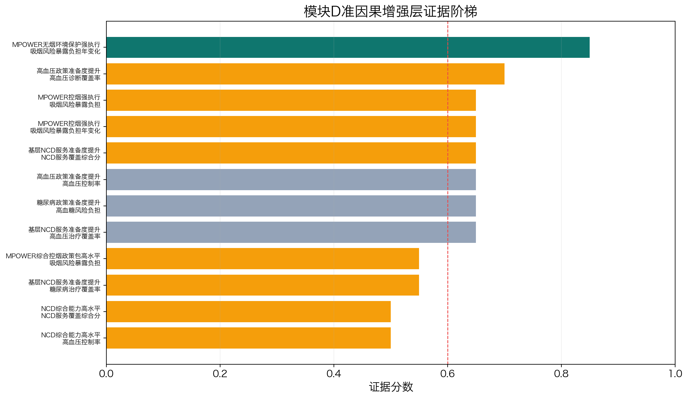
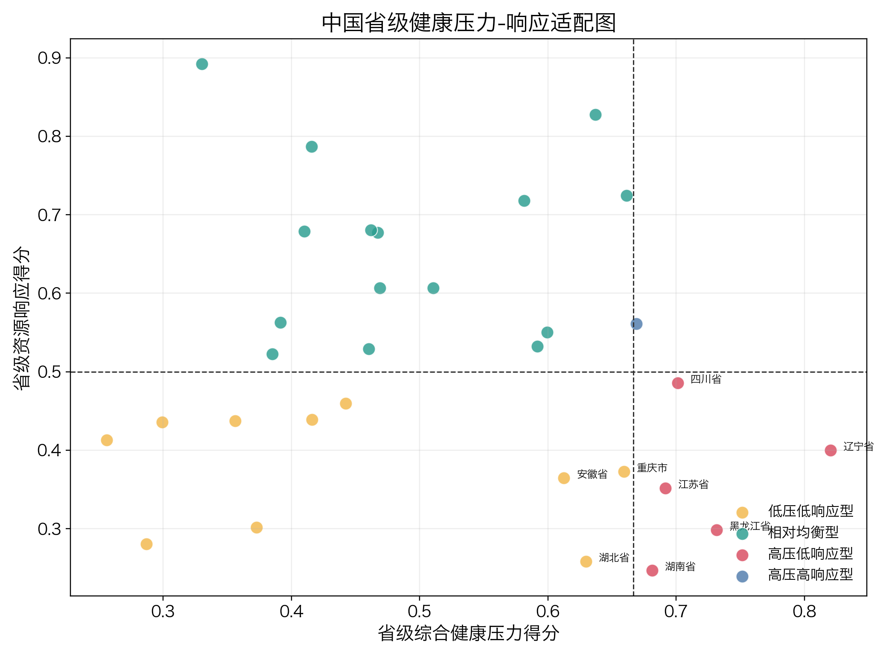

# 4C 大数据 2026

本仓库整理了“全球健康转型中的暴露-负担-响应失配诊断”的分析代码与交互可视化。分析端用 Python 完成全球 ABCD 框架、模块 D 政策证据与中国省级映射；展示端用 React、Three.js 和 D3 把结果组织为可交互的全球-中国联动地图。

## 结果预览

| 全球脆弱性分型 | ABC 预测稳健性 |
|---|---|
|  |  |
| **模块 D 政策证据梯** | **中国省级压力-响应映射** |
|  |  |

## 仓库结构

```text
4C大数据2026/
├── 雷霆医疗队/       Python 分析代码、方法文档和数据索引
├── Global Map/        React/Vite 交互可视化
├── docs/images/       README 精选结果图
├── scripts/           仓库验证脚本
└── .gitignore         缓存、大数据和派生产物排除规则
```

## 快速启动可视化

需要 Node.js 18+。前端内置最小派生数据快照，可独立运行。

```bash
cd "Global Map"
npm ci
npm run data
npm run dev
```

生产构建：

```bash
npm run verify
```

## Python 分析

安装依赖并做静态检查：

```bash
python3 -m venv .venv
source .venv/bin/activate
pip install -r 雷霆医疗队/requirements.txt
python3 -m py_compile 雷霆医疗队/01_main/*.py
python3 雷霆医疗队/01_main/a_foundation.py \
  --project-root 雷霆医疗队 --check
```

全量分析需要原始/清洗数据，请按 [`雷霆医疗队/08_data_inventory/数据目录索引.md`](雷霆医疗队/08_data_inventory/数据目录索引.md) 准备数据，再按 [`雷霆医疗队/run_order.md`](雷霆医疗队/run_order.md) 执行。

一键仓库校验：

```bash
bash scripts/verify_repo.sh
```

## 数据边界

- Git 中不包含数百 MB 的原始数据、`09_data_clean`、生成图片、报告、PPT 或视频。
- `Global Map/data_snapshot/` 是为前端复现保留的最小派生结果，不是全部原始数据。
- 完整 Python 分析在找不到外部数据时应立即报错，不使用伪造数据。
- 公开数据仍受各原始来源的许可、引用和地图合规条款约束。

## 结论边界

- 模块 D 的最强证据定位是“严格准因果强候选”，不声明随机实验级强因果。
- 中国省级映射用于政策适配和展示，不反向证明全球因果结论。
- 地图页面用于研究演示，不作为行政区划或导航依据。

更详细的方法和判定口径见 [`雷霆医疗队/README.md`](雷霆医疗队/README.md)。
